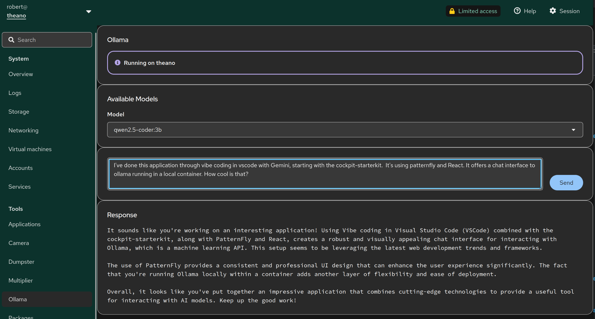

# using the Cockpit starter-kit as foundation for Vibe Coding

Take this with a grain of salt, it was produced by prompting only without code review or such. 

# what it does

It's an application which connects to a local ollama(-container) and offers a chat window.

# Further reading

 * The [Starter Kit announcement](https://cockpit-project.org/blog/cockpit-starter-kit.html)
   blog post explains the rationale for this project.
 * [Cockpit Deployment and Developer documentation](https://cockpit-project.org/guide/latest/)
 * [Make your project easily discoverable](https://cockpit-project.org/blog/making-a-cockpit-application.html)
